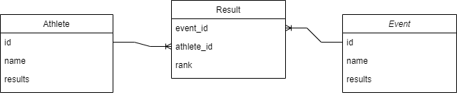

## Documentation
[flask](https://flask.palletsprojects.com/en/2.3.x/)  
[flask-smorest](https://flask-smorest.readthedocs.io/en/latest/)  
[flask-sqlalchemy](https://flask-sqlalchemy.palletsprojects.com/en/3.0.x/)

## How to run API locally with Docker
1.  `docker build -t IMAGE_NAME .`: Builds Docker image.
2. 
- WINDOWS: `docker run -dp 5000:5000 -w /app -v "/c/LOCAL_PATH_TO_PROJECT_FOLDER/flask-workshop:/app" IMAGE_NAME sh -c "flask run --host 0.0.0.0"`: Run Docker container with hot reloading.
- LINUX: `docker run -dp 5000:5000 -w /app -v "$(pwd):/app" IMAGE_NAME sh -c "flask run --host 0.0.0.0"`: Run Docker container with hot reloading.
3. API should work! Use Postman to test.

## Diagram of data model

## Task 1 - Hello world
Edit `app.py` such that when running command `flask run`, the browser will show "Hello world!".

## Task 2 - Athlete model and endpoint
* Follow along

## Task 3 - Event model and endpoint
* Try yourself

## Task 4 - Result model and endpoint
* Follow along

## Task 5 - Add swagger documentation
* Follow along
  
## Task 6 - Add authentication
1. API key
2. OAuth 2.0 JSON Web Token (JWT) with Azure AD

## Task 7 - Do whatever you want
Do whatever you want